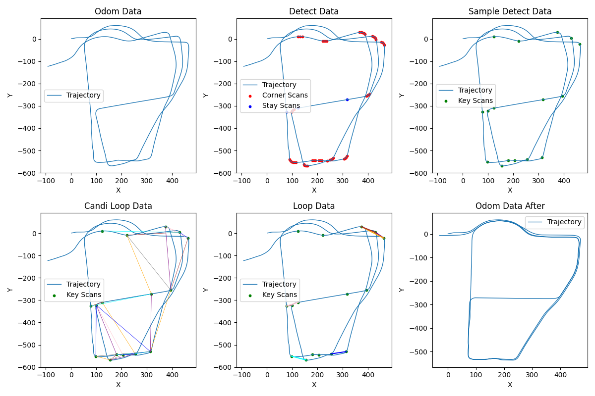
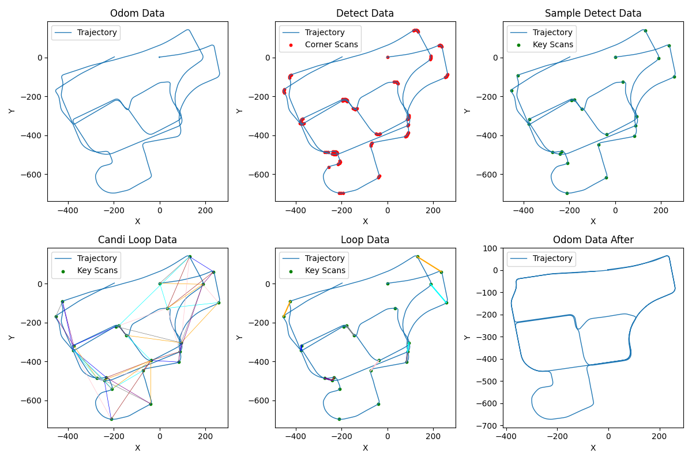
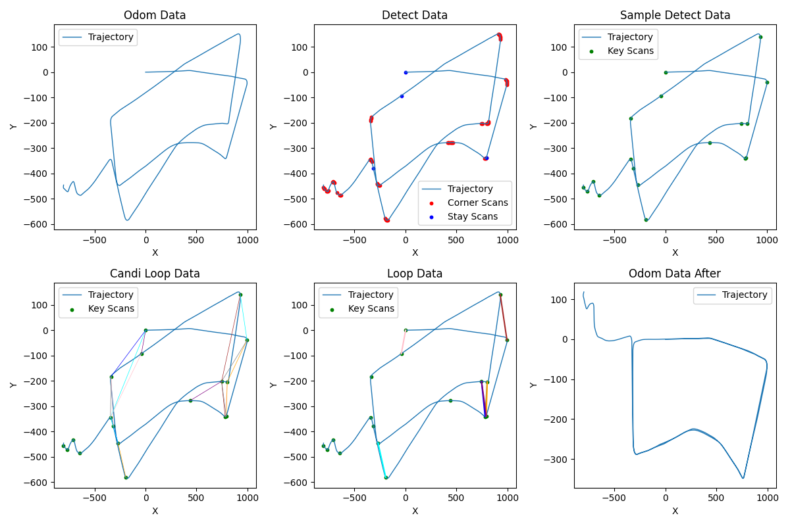

# BP-LCD

## Behaviour Prediction - Loop Closure Detection

---

### 基本设想与原理

 ```
对于车载SLAM来说，更容易出现较长时间和距离的累积漂移。
然而，车辆行驶在道路上，利用行为预测，可以提取出一些特征扫描帧，而这些扫描帧也是容易出现回环的地方。
具体方式为：
1）如果判断到出现停留（如10s位姿未变化）则可能是在一个路口，车辆正在等待红绿灯
2）如果判断到短时间大幅旋转，则也可能是在某一个路口，车辆进行转向变道
针对上述两种行为的预测可以检测出一些特征扫描帧，这些扫描帧（红绿灯路口，转角路口）是特征较明显的，一旦出现回环，容易判断，且不易出错，具有良好的鲁棒性。

仅采用几个准确稳定的回环纠正位姿，可能精度还没有非常高，可以再大致纠正的基础上，进行邻近检索（如20范围内）再一次全局优化，可以得到精度更高的全局一致性地图。
 ```

#### 实现及结果(暂未进行邻近检索再优化，待完成)

数据集：MulRan DCC02, KAIST02, RiverSide02 序列

DCC02


KAIST02


RiverSide02



